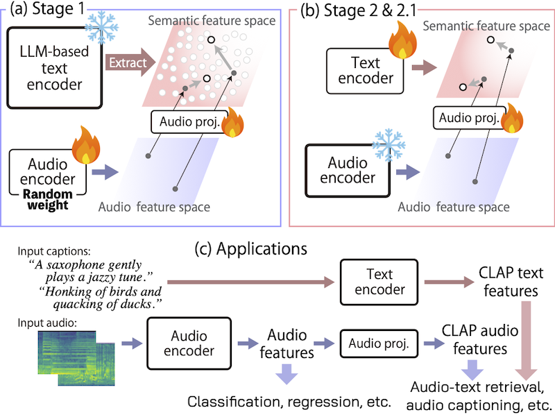

# M2D-CLAP: Exploring General-purpose Audio-Language Representations Beyond CLAP

> 📄 **If you are looking for the procedure for the 2024 Interspeech paper**, please refer to the [2024 README](2024/README.md).

<figure>
  
</figure>

This sub-repository provides codes for our M2D-CLAP papers, including the setup procedure for the training caption data and the pre-training steps.

```bibtex
@article{niizumi2025m2d-clap,
    author  = {Niizumi, Daisuke and Takeuchi, Daiki and Yasuda, Masahiro and Nguyen, Binh Thien and Ohishi, Yasunori and Harada, Noboru},
    journal = {IEEE Access}, 
    title   = {{M2D-CLAP: Exploring General-purpose Audio-Language Representations Beyond CLAP}}, 
    year    = {2025},
    volume  = {13},
    pages   = {163313-163330},
    doi={10.1109/ACCESS.2025.3611348}}

@inproceedings{niizumi2024m2d-clap,
    title   = {{M2D-CLAP: Masked Modeling Duo Meets CLAP for Learning General-purpose Audio-Language Representation}},
    author  = {Daisuke Niizumi and Daiki Takeuchi and Yasunori Ohishi and Noboru Harada and Masahiro Yasuda and Shunsuke Tsubaki and Keisuke Imoto},
    booktitle={Interspeech},
    year    = {2024},
    pages   = {57--61},
    doi     = {10.21437/Interspeech.2024-29}}
```

## Overview

M2D-CLAP pre-training consists of four stages. The table below summarizes each stage at a glance.

| Stage | Encoder trained | Audio data | Text features | File list |
|:------|:----------------|:-----------|:--------------|:----------|
| **1** | Audio | AudioSet + VGGSound + WavCaps | pre-computed LLM embeddings | `data/files_A_S_V_S_W_C_X.csv` |
| **1.1** | Audio | AudioSet | — | — |
| **2** | Text (BERT) | + AudioCaps + Clotho | raw captions, encoded on the fly | `data/files_A_S_V_S_W_C_A_C_X_t_E_U.csv` |
| **2.1** | Text (BERT) | WavCaps + AudioCaps + Clotho subset | raw captions, encoded on the fly | `data/files_w_c_a_c_x_t_e_u.csv` |

**Stage 1** jointly trains the audio encoder via both M2D (masked modeling) and CLAP (audio-language alignment). Text features are LLM-based sentence embeddings pre-computed offline and stored as `data/cache/.../capembs_*.npy` — no text encoder runs during training. Audio data is drawn from `data/audioset_lms/`, `data/vggsound_lms/`, and `data/wavcaps_lms/`.

**Stage 1.1** fine-tunes the audio encoder on AudioSet via EVAR (`ftas.sh`), extending the input length from 6.08 s (608 frames) to 10 s (1001 frames). No caption data is required.

**Stage 2** starts from the Stage 1.1 model and fine-tunes the text encoder (BERT). Raw caption texts stored in `data/rawcap_*.csv` are encoded on the fly by the BERT encoder during training. AudioCaps (`data/audiocaps_lms/train/`) and Clotho (`data/clotho_lms/development/`) are added to the training set.

**Stage 2.1** further refines the text encoder on the WavCaps + AudioCaps + Clotho subset, with masking disabled (`mask_ratio=0.0`).

## 1. Setup

Our implementation converts texts into sentence (semantic) embeddings in advance (offline) rather than on the fly.

1. Prepare for the M2D pre-training on AudioSet by following the [3. Pre-training From Scratch](../README.md#3-pre-training-from-scratch).
    - Especially, convert your AudioSet audio into log-mel spectrograms and place them in `data/audioset_lms`, following the [Example preprocessing steps (AudioSet)](../data/README.md#example-preprocessing-steps-audioset).

2. Similarly, prepare log-mel spectrogram files for the other datasets:
    - `data/vggsound_lms/` — VGGSound
    - `data/wavcaps_lms/` — WavCaps (sub-folders per source: `AudioSet_SL_flac/`, `BBC_Sound_Effects_flac/`, `FreeSound_flac/`, `SoundBible_flac/`)
    - `data/audiocaps_lms/train/` — AudioCaps (Stage 2)
    - `data/clotho_lms/development/` — Clotho (Stage 2)

3. Run `Generate-File-Lists.ipynb` to create the training file lists:
    - `data/files_A_S_V_S_W_C_X.csv` — Stage 1: AudioSet + VGGSound + WavCaps, excl. AudioCaps/Clotho/ESC-50/US8K
    - `data/files_A_S_V_S_W_C_A_C_X_t_E_U.csv` — Stage 2: Stage 1 datasets + AudioCaps/Clotho training splits
    - `data/files_w_c_a_c_x_t_e_u.csv` — Stage 2.1

4. Run `Generate-Raw-Captions.ipynb` to download and save raw caption texts as `data/rawcap_*.csv`:
    - Sound-VECaps, Auto-ACD (AudioSet & VGGSound), AudioCaps Alternative 4, WavCaps, AudioCaps, Clotho

5. Run `cache_captions.py` to encode the captions into embeddings:
    ```shell
    python -m clap.cache_captions --bs 8
    ```
    - Creates `data/cache/m2d_clap_vit_base-80x608p16x16p16kpN-_N_V_E_m_b_2/capembs_*.npy`
    - `--bs 8` is intentionally small due to the LLM-based text encoder's memory requirements. Adjust to a larger value if your GPU memory allows.

In summary, the following data should be ready.

- `data/audioset_lms/` — AudioSet log-mel spectrograms
- `data/vggsound_lms/` — VGGSound log-mel spectrograms
- `data/wavcaps_lms/` — WavCaps log-mel spectrograms
- `data/audiocaps_lms/train/` — AudioCaps log-mel spectrograms (Stage 2)
- `data/clotho_lms/development/` — Clotho log-mel spectrograms (Stage 2)
- `data/files_audioset.csv` — AudioSet file list
- `data/files_A_S_V_S_W_C_X.csv` — Training file list for Stage 1
- `data/files_A_S_V_S_W_C_A_C_X_t_E_U.csv` — Training file list for Stage 2
- `data/files_w_c_a_c_x_t_e_u.csv` — Training file list for Stage 2.1
- `data/rawcap_*.csv` — Raw caption texts
- `data/cache/.../capembs_*.npy` — Caption embeddings

## 2. Pre-training

Training proceeds in four stages. Stage 1 jointly learns general audio and CLAP features; Stage 1.1 fine-tunes on AudioSet; Stages 2 and 2.1 refine the CLAP features using the Stage 1.1 model as a base.

> **Note:** Replace `your/ssd/lms_data` with the path to your LMS data directory. Placing data on fast storage (SSD recommended) significantly speeds up training. If `--data_path` is omitted, the `data/` directory at the repository root is used.

**Stage 1** — Joint M2D + CLAP pre-training on a large dataset (AudioSet + VGGSound + WavCaps) with LLM-based semantic embeddings. Generalizable audio features are trained alongside CLAP features.

```shell
OMP_NUM_THREADS=1 torchrun --nproc_per_node=4 -m clap.train_clap --input_size 80x608 --patch_size 16x16 --epochs 300 --batch_size 512 --save_freq 50 --seed 7 --model m2d_clap_vit_base --file_caption data/cache/m2d_clap_vit_base-80x608p16x16p16kpN-_N_V_E_m_b_2 --csv_main data/files_A_S_V_S_W_C_X.csv --text_encoder N --loss_off .01 --loss_off_end .01 --sem_mode 1 --data_path your/ssd/lms_data
```

**Stage 1.1** — Fine-tuning on AudioSet using EVAR via `ftas.sh`. See [2. Evaluating M2D](../README.md#2-evaluating-m2d) in the root README for EVAR setup instructions. Run from the `evar/` directory at the repository root.

```shell
bash ftas.sh m2d_clap_vit_base-80x608p16x16p16kpN-241118-ASVSWC/checkpoint-300.pth 1 42 300
```

After running, the output is saved under `evar/log/m2d_clap_vit_base-80x608p16x16p16kpN-...`. Before using it in Stage 2, rename the folder by changing `80x608` to `80x1001` in the folder name. This is because fine-tuning extends the input length from 608 (6.08 s) to 1001 (10 s), and the folder name should reflect the actual input size used.

**Stage 2** — CLAP-only fine-tuning using the Stage 1.1 checkpoint as base (`--base_model`). AudioCaps and Clotho training splits are added to the dataset.

```shell
OMP_NUM_THREADS=1 torchrun --nproc_per_node=4 -m clap.clap_only --epochs 30 --eval_after 30 --save_freq 30 --csv_main data/files_A_S_V_S_W_C_A_C_X_t_E_U.csv --mask_ratio 0.3 --base_model m2d_clap_vit_base-80x1001p16x16p16kpN-241118-ftAS-eb08508e/weights_ep66it3124-0.49058_loss0.0147.pth --sem_mode 1 --text_encoder B --seed 7 --data_path your/ssd/lms_data
```

**Stage 2.1** — Further CLAP refinement on the WavCaps + AudioCaps + Clotho subset (no masking), initialized from the Stage 2 checkpoint. Both `--base_model` and `--finetune` must point to the same Stage 2 checkpoint.

```shell
OMP_NUM_THREADS=1 torchrun --nproc_per_node=4 -m clap.clap_only --epochs 30 --eval_after 30 --save_freq 30 --csv_main data/files_w_c_a_c_x_t_e_u.csv --mask_ratio 0.0 --base_model m2d_clap_vit_base-80x1001p16x16p16kpBpTI-241118-ftAS-eb08508e-MdfASVSWCACXtEUs777-241121/checkpoint-30.pth --sem_mode 1 --text_encoder B --finetune m2d_clap_vit_base-80x1001p16x16p16kpBpTI-241118-ftAS-eb08508e-MdfASVSWCACXtEUs777-241121/checkpoint-30.pth --data_path your/ssd/lms_data
```

## 3. Evaluation

Quick example: [examples/Example_4_CLAP2025.ipynb](../examples/Example_4_CLAP2025.ipynb).

The evaluation steps follow the [original M2D](../README.md#2-evaluating-m2d).

For the zero-shot evaluation, refer to the [../all_eval.sh](../all_eval.sh), which contains all the command lines exactly used for the paper.

## Examples

| Description | Notebook |
|:------------|:---------|
| Zero-shot ESC-50 classification with M2D-CLAP | [ examples/Colab_M2D-CLAP_ESC-50_ZS.ipynb](http://colab.research.google.com/github/nttcslab/m2d/blob/master/examples/Colab_M2D-CLAP_ESC-50_ZS.ipynb) |
| Audio feature visualization example with M2D-CLAP | [ examples/Colab_M2D-CLAP_ESC-50_VizualizeEmbs.ipynb](http://colab.research.google.com/github/nttcslab/m2d/blob/master/examples/Colab_M2D-CLAP_ESC-50_VizualizeEmbs.ipynb) |

